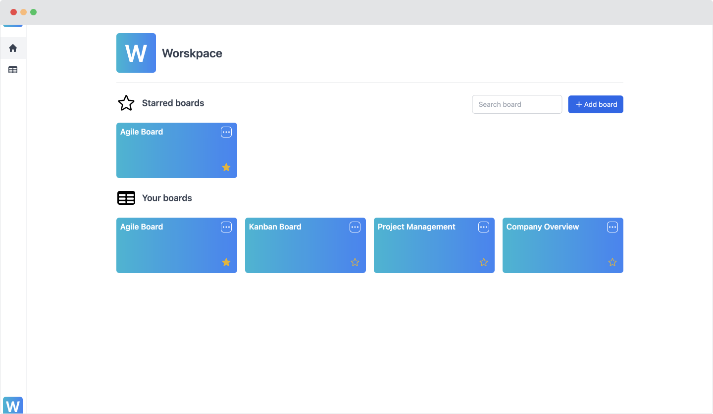
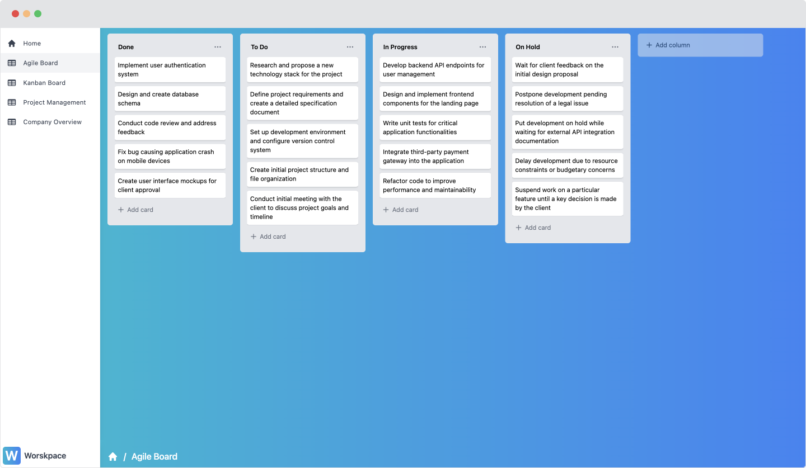

# Drag and Drop Boards (Vue 3 + Composition API + Pinia + TypeScript + TailwindCSS)

[Live demo](https://vue-boards-drag-and-drop.netlify.app/)

A Single Page Application for managing boards and cards through drag & drop functionality. It is built with Vue 3, Composition API, Pinia, TypeScript, and TailwindCSS. The application synchronizes all data changes into the browser's localStorage.

Please note that this application is intended for demonstration and learning purposes only. It is not suitable for professional workflows in its current version.

## Features

- Intuitive interface for managing boards.
- Drag & drop functionality for managing columns and cards.
- Responsive design with TailwindCSS.
- Data persistence using browser localStorage.
- Built with Vue 3, Composition API, and Pinia.
- Fully typed with TypeScript.
